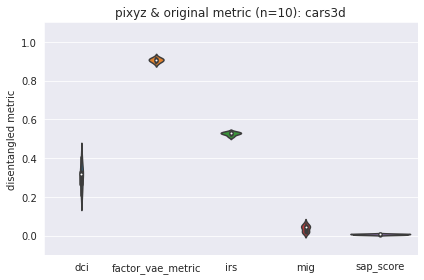

# dgmvae

Deep Generative Model: Variational Auto-Encoder

# Requirements

* Python == 3.7
* PyTorch == 1.4.0 ([Official](https://pytorch.org/))
* Torchvision == 0.5.0 ([GitHub](https://github.com/pytorch/vision))
* Pixyz == 0.1.4 ([GitHub](https://github.com/masa-su/pixyz))
* numpy == 1.18.1
* scikit-learn == 0.22.2

For running scripts, the following libraries are also needed.

* PyTorch Lightning == 0.7.1 ([GitHub](https://github.com/PyTorchLightning/pytorch-lightning))
* pandas == 1.0.1

# How to use

## Set up environments

Clone repository.

```bash
git clone https://github.com/rnagumo/dgmvae.git
cd dgmvae
```

Install the package in virtual env.

```bash
python3 -m venv .venv
source .venv/bin/activate
pip3 install .

# Install other requirements.
pip3 install pytorch-lightning==0.7.1 pandas==1.0.1
```

Or use [Docker](https://docs.docker.com/get-docker/) and [NVIDIA Container Toolkit](https://github.com/NVIDIA/nvidia-docker). This Dockerfile creates a very large docker image (>4GB), so please check the upper limit of the docker memory size on your computer.

```bash
docker build -t dgmvae .
docker run -it dgmvae bash
```

You can run container with GPUs by Docker 19.03.

```bash
docker run --gpus all -it dgmvae bash
```

## Prepare dataset

Download dataset ([dSprites](https://github.com/deepmind/dsprites-dataset/), [mpi3d_toy](https://github.com/rr-learning/disentanglement_dataset), or [cars3d](http://www.scottreed.info/)) in the data folder.

```bash
bash bin/download.sh
```

## Run experiment

Training and evaluation. Shell scripts in `bin` folder contains the necessary settings for building the environment.

```bash
# Usage
bash bin/train_cars3d.sh <model-name> <random-seed>

# Example
bash bin/train_cars3d.sh beta 0
```

Evaluation with original metrics (run on CPU).

```bash
# Usage
bash bin/eval_cars3d.sh <model-name> <random-seed>

# Example
bash bin/eval_cars3d.sh beta 0
```

# Experimental Results

VAE model included in disentanglement_lib are trained with the same setteings. Pre-trained models (TF models) are downloaded from disentanglement_lib. Although pre-trained models are tested with 50 different random seeds, my experiments are tested with 10 or 5 random seeds due to the lack of GPUs.

**Note** DIP-VAE (1, 2) and TC-VAE do not reproduce the disentanglement_lib results.

|Model|Ours|disentanglement_lib|
|:-:|:-:|:-:|
|BetaVAE|||
|FactorVAE|||
|DIPVAE-1|not reproduced||
|DIPVAE-2|not reproduced||
|TC-VAE|not reproduced||

Other models not in disentanglement_lib are also trained and evaluated.

|Model|Ours|
|:-:|:-:|
|JointVAE||
|AAE||
|AVB||

I tested our implementation for disentanglement metrics. The following figures show the comparison of our implementation and disentanglement_lib with the same model. These figures show that my implementation seems correct.

|Model|Our implementation|disentanglement_lib|
|:-:|:-:|:-:|
|BetaVAE|||

# Reference

* Preferred Networks: [Disentangled な表現の教師なし学習手法の検証](https://tech.preferred.jp/ja/blog/disentangled-represetation/)
* PyTorch VAE by AntixK: [GitHub](https://github.com/AntixK/PyTorch-VAE)
* disentanglement_lib: [GitHub](https://github.com/google-research/disentanglement_lib)
* NeurIPS 2019 : Disentanglement Challenge Starter Kit: [GitHub](https://github.com/AIcrowd/neurips2019_disentanglement_challenge_starter_kit)
